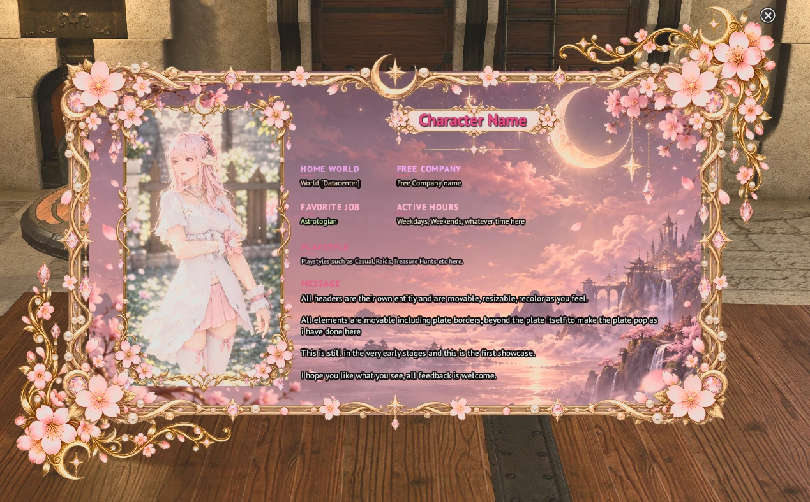
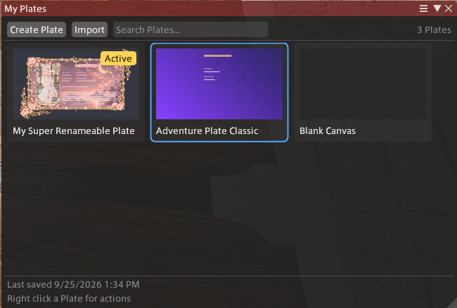
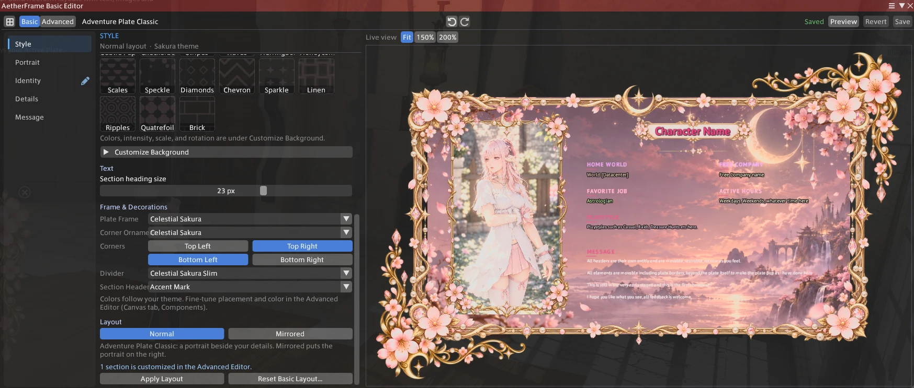
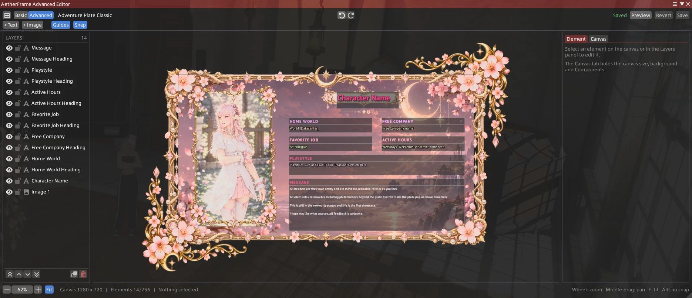

# AetherFrame

[](https://github.com/richhiiee/AetherFrame/actions/workflows/build.yml)

**Enhanced character Plates for Final Fantasy XIV.**

**AetherFrame 0.1.5 Alpha** · [Changelog](CHANGELOG.md) · [Versioning](docs/Versioning.md)

AetherFrame is a [Dalamud](https://github.com/goatcorp/Dalamud) plugin for designing character Plates: profile cards that start from the familiar shape of the in-game Adventure Plate and can grow into fully freeform layouts.

> **Basic mode feels like FFXIV. Advanced mode removes the restrictions.**

> [!NOTE]
> AetherFrame is in **early development**. It is not an official Dalamud repository plugin, and its features, file formats and internal APIs may still change.

---

## Screenshots

AetherFrame includes a local Plate library, a guided Basic Editor, a freeform Advanced Editor, and a clean in-game Plate Viewer.

### Plate Viewer



A finished Celestial Sakura Plate in the Plate Viewer, a clean presentation view for the saved Active Plate, opened with `/af view`.

### Editing and Plate Management

#### My Plates



Create, organize, duplicate, import, preview, and choose the Active Plate from a local Plate library.

#### Basic Editor



A familiar Adventure Plate-style workflow for quickly editing layout, identity, details, message content, and visual styling.

#### Advanced Editor



Freeform control over text, images, Components, layering, placement, scaling, rotation, and the Plate canvas.

---

## Features

### Plates and My Plates

- **Multiple saved Plates.** Each Plate is a complete, independent design. Keep as many as you like.
- **My Plates.** Browse, search, preview, rename, duplicate and delete Plates, and choose which Plate is Active for each character. Duplicating a Plate is an easy way to keep several variations of a look side by side.
- **Plate previews.** Plate cards in My Plates and a preview pane show each Plate at a glance.
- **Plate Viewer.** A dedicated window that shows a Plate fitted to its size.
- **Clean Preview.** Hide the editor UI and see the Plate exactly as it will look.

### Basic Editor

A structured editor modelled on FFXIV's Adventure Plates. You fill in sections, and AetherFrame handles the layout.

- **Identity and details**: name, title, Home World, Free Company, and up to eight Favorite Jobs in your chosen order, shown as full names when they fit and as job abbreviations when they don't.
- **Portrait**: import your own image, with Fill / Fit / Stretch framing and a mirrored layout option.
- **Playstyle, active hours and a free-form message.**
- **Themes, backgrounds and patterns**: built-in colour themes plus procedural background patterns.

### Advanced Editor

A freeform canvas for when the Basic layout isn't enough.

- Place, move, resize and rotate text and image elements anywhere on the Plate.
- Layers, snapping, undo/redo and per-element styling.
- Custom text with bundled fonts, so a Plate renders the same on every machine.
- Custom images from your own files.

### Components

Reusable decorative pieces you add to a Plate and restyle without redrawing anything.

- **Procedural Components**: Plate frames, portrait frames and overlays, name backings, dividers, section headers and corner ornaments, all drawn in code and tintable.
- **Bundled graphical Components**: original artwork created with AI assistance, shipped inside the plugin. This currently means the Celestial Dream *Astrolabe Pivot* corner ornament and the full-color **Celestial Sakura** set: a background, Plate frame, portrait frame, name backing, two dividers and a corner ornament.
- **Corner-specific placement**: choose which corners a corner ornament appears on.
- **Overflow**: Components can deliberately extend past the Plate's edges, and previews account for it.

### Templates

- Start a new Plate from a built-in Template (*Adventure Plate Classic* or *Blank Canvas*).
- Save any Plate as your own Template and reuse it later.

### Import and export

- Share a Plate as a single **`.aetherframe`** file that includes the images it uses.
- Imports are validated before anything is written. Size limits, path checks, image checks and document validation all run on a staging copy first.

### Local assets and data safety

- Imported images are stored and tracked locally. Unused images are not removed automatically in this version.
- **Forward compatibility.** Plate data is versioned and migrated. Content from a newer version of AetherFrame that this version doesn't understand is preserved rather than discarded.

---

## What’s coming

AetherFrame 0.1.5 is still an early version. There is a lot more I want to build before I consider it finished.

### More ways to design Plates

I want to keep expanding what you can actually make. That means more visual sets, Templates, backgrounds, typography options, images, Components, and more control in the Advanced Editor.

### More for My Plates

My Plates will grow beyond simply storing your Plates. I want better organization, restoring Plates from Trash, improved previews, more Template options, and better ways to keep different versions of the same design.

### More in the Basic Editor

The Basic Editor is supposed to feel familiar if you already know FFXIV Adventure Plates. I want to give it more customization while keeping it simple enough that you do not have to use the Advanced Editor unless you want to.

### Player sharing

Eventually I want players to be able to share Plates directly with each other. AetherFrame will stay local first, so your own copy stays on your machine and sharing only happens when you choose to do it.

### Viewing another player’s Plate

One idea is being able to target another player and open their AetherFrame Plate if they have chosen to make one available. The exact interaction is not final yet, but I want viewing another player’s Plate to be something deliberate rather than something that happens automatically.

### Optional RP details

I would also like to add a small amount of optional character information for people who want it. The idea is to complement the Plate, not turn AetherFrame into another full RP profile plugin.

### Dalamud release

There is still performance work, UI polish, accessibility work, and general cleanup to do before I submit AetherFrame to the official Dalamud plugin repository.

The finished idea is simple: start with something that feels familiar to anyone who has made an FFXIV Adventure Plate, then give people the freedom to take it much further.

---

## Local first

Everything AetherFrame does today happens on your own machine.

- No account is needed.
- Editing is entirely local.
- Plates, Templates and images are stored in the plugin's local configuration folder.
- Import and export are file-based: you choose what to export and who you give it to.
- No online service is required for any of the core experience.

## Privacy direction

Sharing Plates with other players is a possible future direction, not a current feature. If it arrives, the intent is:

- **Intentional sharing** rather than passive discovery.
- No silent telemetry.
- No automatic scraping of nearby players.
- No public Content IDs, no alt correlation, and no public location history.

---

## Installation

AetherFrame is not in the Dalamud plugin installer yet. The plan is to submit it to the official Dalamud plugin repository's testing track first, so testers can install it from `/xlplugins` with **Get plugin testing builds** turned on. There won't be a separate custom plugin repository.

Until then, you can build it from source and load it as a dev plugin (see below). If you'd like to help test, the [tester guide](docs/Testing.md) explains how to install a test build once one is available, what to look at, and how to report problems.

## Building from source

### Requirements

- Windows with FFXIV, XIVLauncher and Dalamud installed, and the game run with Dalamud at least once
- [.NET 10 SDK](https://dotnet.microsoft.com/download)
- Dalamud API 15 (the project uses `Dalamud.NET.Sdk` 15)
- **x64** platform. The plugin project only builds for x64.

### Build

From the repository root:

```bash
dotnet build AetherFrame/AetherFrame.csproj --configuration Debug -p:Platform=x64
```

```bash
dotnet build AetherFrame/AetherFrame.csproj --configuration Release -p:Platform=x64
```

The output is written to `AetherFrame/bin/x64/<Configuration>/`.

### Tests

`AetherFrame.Tests` covers the Dalamud-independent logic (documents, persistence, packages, editor sessions and layout) and runs without the game:

```bash
dotnet test AetherFrame.Tests/AetherFrame.Tests.csproj
```

### Loading in game

1. Open `/xlsettings` → **Experimental** and add the full path to the built `AetherFrame.dll` under **Dev Plugin Locations**.
2. Open `/xlplugins` → **Dev Tools → Installed Dev Plugins** and enable AetherFrame.
3. Use **`/aetherframe`** (or **`/af`**) to open My Plates. See [Commands](#commands).

### Commands

`/af` is the short form of `/aetherframe`. Both accept the same arguments.

| Command | What it does |
|---|---|
| `/aetherframe`, `/af` | Opens or closes My Plates |
| `/aetherframe view`, `/af view` | Shows your character's Active Plate |
| `/aetherframe version`, `/af version` | Prints the running AetherFrame version and build in chat |

---

## Project structure

```
AetherFrame/            the plugin
  Domain/               Plate documents, Basic layout rules, Components, Templates (no Dalamud dependencies)
  Persistence/          versioned JSON storage, schema migrations, unknown-data preservation
  Services/             Plate & Template libraries, assets, fonts, .aetherframe packages, thumbnails
  UI/Editor/            editor sessions: history, selection, snapping, Basic/Advanced coordination
  UI/Rendering/         Plate renderer, backgrounds, text, Components, previews
  Windows/              Dalamud/ImGui windows: My Plates, Basic Editor, Advanced Editor, Plate Viewer, import
  Hosting/              thin adapters over Dalamud services
  Assets/               bundled Component artwork, embedded in the DLL
  Fonts/                bundled fonts (SIL Open Font License), embedded in the DLL
AetherFrame.Tests/      pure-logic tests that build without Dalamud
```

### Key concepts

- **Plate / Profile document.** A Plate's content is a single versioned document (`ProfileDocument`) holding the canvas, background, elements (text and images), Components and Basic-mode settings. Both editors work on the same document, so a Plate can move from Basic to Advanced.
- **My Plates (`PlateLibraryService`).** Stores every saved Plate plus per-character bindings (which Plates belong to a character and which one is Active).
- **Active Plate.** The Plate AetherFrame presents for a character when nothing more specific is asked for (e.g. `/aetherframe view`). Resolved in one place (`ActivePlateResolver`); a character with no Active Plate gets an explicit empty state, never a substitute.
- **Basic Editor.** Structured input (identity, portrait, playstyle, message, theme) mapped onto an Adventure Plate-style layout.
- **Advanced Editor.** Direct manipulation of every element on the canvas, with layers, snapping and undo.
- **Templates.** Starting points for new Plates: built-in ones compiled into the plugin, plus user Templates saved locally.
- **Components.** Decorations described by a stable definition id and per-instance settings. Procedural ones are drawn in code, graphical ones use embedded artwork. Plates store only ids, never the art itself.
- **Rendering.** One renderer draws a Plate for the editors, the Plate Viewer, Clean Preview and My Plates previews, so all of them match.
- **Assets.** User images are copied into a local asset store, checked on import and tracked by reference. Unused images are not cleaned up automatically in this version.
- **Packages.** `.aetherframe` files are ZIP-based packages containing a manifest, the Plate document and its images. They are validated in a staging area before anything is imported.

Full-size source artwork for bundled Components lives in the separate [AetherFrameAssets](https://github.com/richhiiee/AetherFrameAssets) repository. The plugin only needs the optimized copies in `AetherFrame/Assets/`.

---

## Development note

I use AI heavily while developing AetherFrame, mainly for implementation and code review. I decide what gets built, how the product works, and test the plugin in game myself. In the terms of the [Dalamud AI Usage Policy](https://dalamud.dev/plugin-publishing/ai-policy), that is the *Copilot* level.

The plugin icon was generated with ChatGPT and then refined, and the bundled Celestial Dream and Celestial Sakura artwork was also created with AI assistance. The plugin's description in the Dalamud installer says so. The Celestial Sakura files are shipped unmodified, so they keep their embedded C2PA Content Credentials, which record how each image was made. I'd like to replace the icon with a hand-made one before AetherFrame goes into the official Dalamud repository.

## Support and feedback

AetherFrame is still taking shape, and feedback is very welcome on the [issue tracker](https://github.com/richhiiee/AetherFrame/issues):

- **Something broken?** Open a [bug report](https://github.com/richhiiee/AetherFrame/issues/new?template=bug_report.yml). Include what `/af version` prints.
- **An idea?** Open a [feature request](https://github.com/richhiiee/AetherFrame/issues/new?template=feature_request.yml).
- **Testing a build?** See the [tester guide](docs/Testing.md).

Issues are public, so leave out character names and anything else you'd rather keep to yourself.

## License

AetherFrame is licensed under the [GNU Affero General Public License v3.0](LICENSE.md).

Bundled fonts are licensed separately under the SIL Open Font License 1.1. See `AetherFrame/Fonts/THIRD-PARTY-FONT-LICENSES.txt`.

## Links

- Repository: <https://github.com/richhiiee/AetherFrame>
- Changelog: [CHANGELOG.md](CHANGELOG.md)
- Tester guide: [docs/Testing.md](docs/Testing.md)
- Releasing and Dalamud submission: [docs/Releasing.md](docs/Releasing.md)
- Assets: <https://github.com/richhiiee/AetherFrameAssets>

---

<sub>AetherFrame is a fan-made plugin and is not affiliated with or endorsed by Square Enix. FINAL FANTASY XIV © SQUARE ENIX CO., LTD.</sub>
